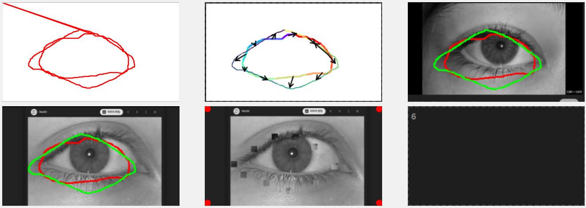

# 곡선 매칭 및 픽셀 전송 도구



두 개의 폐곡선을 그리고, 곡선 세그먼트 간 대응 관계를 설정한 후, 대응 관계에 따라 이미지 간 픽셀을 전송하는 PyQt6 기반 인터랙티브 도구입니다.

## 주요 기능

- ✏️ **인터랙티브 곡선 그리기**: 마우스로 캔버스에 두 개의 폐곡선 그리기
- 🎨 **다중 뷰 시각화**: 여러 이미지 뷰에 곡선 오버레이 표시
- 🔗 **세그먼트 매칭**: 클릭으로 곡선 세그먼트 간 대응 관계 생성
- 📋 **픽셀 전송**: 매칭을 기반으로 표준 이미지에서 객체 이미지로 패치 복사
- 🎯 **시각적 피드백**: 색상으로 구분된 세그먼트와 대응 관계를 보여주는 화살표

## 빠른 시작

### 필요 패키지

```bash
pip install PyQt6 numpy opencv-python matplotlib scipy
```

### 사용 방법

1. **이미지 준비**: 프로젝트 디렉토리에 `std.png` (표준)와 `obj.png` (객체) 배치

2. **애플리케이션 실행**:
```bash
python main.py
```

3. **작업 흐름**:
   - **Run** 버튼 클릭
   - 마우스로 두 개의 폐곡선 그리기 (시작점으로 돌아오면 자동으로 닫힘)
   - 세그먼트 클릭하여 매칭 생성: 표준 곡선 (굵게, 무지개색) → 객체 곡선 (얇게, viridis 색상)
   - **ESC** 키를 눌러 완료 및 픽셀 전송
   - view5에서 수정된 객체 이미지 결과 확인

## 프로젝트 구조

```
project/
├── core/
│   ├── curve_drawer.py       # 인터랙티브 곡선 그리기
│   ├── curve_segment.py      # 세그먼트 분할 및 매칭
│   └── image_display.py      # 이미지 표시 유틸리티
├── coords.py                  # 좌표 변환
├── image_io.py                # 안전한 이미지 입출력
├── generate.py                # 메인 통합 모듈
├── show_generated_views.py   # 진입점
├── main.py                    # Qt 애플리케이션
└── README.md
```

## 핵심 컴포넌트

### CurveDrawer
QGraphicsView에서 인터랙티브 폐곡선 그리기 처리
- 마우스가 시작점으로 돌아오면 자동으로 곡선 닫기
- ESC로 그리기 취소

### SegmentMatcher
곡선 세그먼트 분할 및 대응 관계 매칭 관리
- 거리 기반 또는 점 개수 기반 세그먼트 분할
- 클릭으로 매칭하는 인터페이스
- 완료 시 자동 픽셀 전송

### 픽셀 전송
- 11×11 패치 복사 (`patch_size`로 조정 가능)
- 표준 이미지(view3)에서 객체 이미지(view5)로 전송
- 세그먼트 중심점 대응 관계 기반

## 설정

코드에서 파라미터 조정:

```python
# 곡선 그리기 설정
drawer = CurveDrawer(
    view, 
    num_curves=2,           # 그릴 곡선 개수
    close_threshold=8,      # 자동 닫기 거리 임계값
    min_points=10           # 닫기 전 최소 점 개수
)

# 세그먼트 매칭 설정
matcher = SegmentMatcher(
    label, curve1, curve2,
    num_segments=10,        # 곡선당 세그먼트 개수
    segmentation_method="points"  # 또는 "distance"
)
matcher.patch_size = 11     # 픽셀 전송 패치 크기
```

## 개발

단일 책임 원칙을 따르는 깔끔하고 모듈화된 아키텍처로 구축:
- 더 나은 IDE 지원을 위한 타입 힌트
- 포괄적인 독스트링
- 재사용 가능한 컴포넌트
- 테스트 및 확장 용이

자세한 문서는 `PROJECT_STRUCTURE.md`를 참조하세요.

## 라이선스

[라이선스 정보]

## 작성자

이동윤